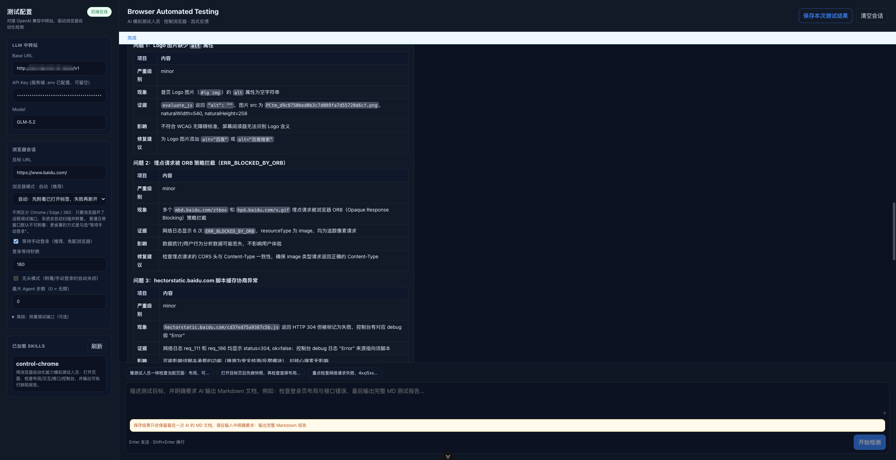

# Browser Automated Testing

AI 驱动的前端质量工具箱（**BAT / Signal Lab**）：从 **需求文档 → 功能点思维导图 → 测试用例 → 浏览器自动化执行 → Markdown 报告** 形成闭环。

- **需求分析**（`/`）：上传 PRD / 粘贴文本，AI 提取可测试功能点，可编辑逻辑思维导图，一键生成并导出测试用例
- **浏览器测试**（`/browser-test`）：输入目标 URL + 提示词（可附带用例文件），Agent 用 Playwright 像测试人员一样操作页面，流式反馈过程并输出完整 Markdown 报告

> 说明：Codex 桌面端的 `control-chrome` 依赖私有 browser runtime / Chrome 扩展。本项目把同一测试思路产品化，使用 **Playwright + OpenAI 兼容接口** 独立运行。`skills/control-chrome` 会作为系统提示注入浏览器测试 Agent。

## 项目预览



## 功能总览

### 公共能力
- 对接第三方中转站（OpenAI 兼容：`base_url` + `api_key` + `model`）
- 配置可写在页面左侧，也可由服务端 `.env` 预填
- 深色精密控制台 UI（Signal Lab 设计语言）
- 页面切换 `keep-alive`，需求分析 / 浏览器测试状态互不丢失

### 需求分析
- 上传需求文档（Markdown / TXT / DOCX）或直接粘贴文本
- 上传后自动解析正文，可在文本框微调后再分析
- **SSE 流式分析**：先展示 AI 对话过程，完成后切换到思维导图；支持中途取消
- 功能点可在思维导图与列表中增删改
- 思维导图支持 **JSON 导入 / 导出**
- 基于功能点 **流式生成测试用例**，支持在线编辑
- 测试用例导出 **Markdown / JSON**，可直接带去浏览器测试页执行

### 浏览器测试
- 流式 SSE 对话，实时显示思考文本与工具轨迹
- Playwright 控制浏览器：打开页面、点击、输入、滚动、截图、读网络/控制台
- 登录态支持：
  - **推荐**：新开浏览器 +「等待手动登录」（无需配置 Chrome/Edge/360）
  - **可选**：扫描本机远程调试端口，附着已打开标签（保留登录态）
- 可上传测试用例文件（MD / JSON / TXT），与提示词 + Skill 一并交给 AI 执行
- 最终输出完整 Markdown 测试报告；可一键 **保存最后一次 AI 的 MD 文档**
- Skills 可扩展（`skills/*/SKILL.md`）

## 推荐端到端流程

```text
1. 需求分析页
   上传 PRD / 粘贴需求
        │
        ▼
   AI 流式提取功能点 ──► 可编辑思维导图 / 功能点列表
        │
        ▼
   一键生成测试用例 ──► 在线编辑 ──► 导出 MD / JSON

2. 浏览器测试页
   配置 LLM + 目标 URL + 登录策略
        │
        ▼
   粘贴提示词，可选上传上一步导出的用例
        │
        ▼
   Agent 工具循环（snapshot / click / network / screenshot ...）
        │
        ▼
   输出完整 Markdown 报告 ──► 保存本地 .md
```

## 快速开始

```bash
npm install
# 首次会自动 playwright install chromium；如失败可手动：
npx playwright install chromium

cp .env.example .env
# 可选：在 .env 写入默认 LLM 配置；也可只在页面左侧填写

npm run dev
```

- 前端：http://127.0.0.1:5199
- 需求分析：http://127.0.0.1:5199/
- 浏览器测试：http://127.0.0.1:5199/browser-test
- Agent 服务：http://127.0.0.1:8787

> 需要 Node.js `^22.18.0` 或 `>=24.12.0`。

常用脚本：

| 命令 | 说明 |
| --- | --- |
| `npm run dev` | 同时启动前端（Vite 5199）与 Agent（8787） |
| `npm run server` | 仅启动 Agent 服务 |
| `npm run build` | 构建前端 |
| `npm run type-check` | TypeScript 检查 |

## 使用方式

### A. 需求分析

1. 打开 http://127.0.0.1:5199/
2. 填写 `Base URL` / `API Key` / `Model`（若服务端 `.env` 已配 API Key，可留空）
3. **上传文件** 或 **粘贴文本**
   - 支持 `.md` / `.txt` / `.docx` 等
   - 上传后会先解析正文到文本框，可再微调
4. 点击 **开始分析功能点**
   - 进入流式对话面板，可随时 **取消生成**
   - 完成后自动回到结果页，展示可编辑思维导图
5. 在思维导图 / 功能点列表中增删改
6. 可选：
   - **导出 JSON**：备份/分享功能点树
   - **导入 JSON**：恢复此前导出的思维导图
7. 点击 **生成测试用例**
   - 同样先流式展示过程，可取消
   - 完成后在「测试用例」页签在线编辑
8. 导出用例为 Markdown 或 JSON，供浏览器测试页上传执行

### B. 浏览器测试

1. 打开 http://127.0.0.1:5199/browser-test
2. 左侧填写中转站 `Base URL`、`API Key`、`Model`
3. 填写目标 URL（或在提示词里说明）
4. 若页面需要登录，二选一：
   - 勾选 **等待手动登录**：开始后在弹出浏览器里登录，系统检测到业务页后自动继续
   - 或用远程调试方式启动浏览器并打开已登录页面，点「重新扫描」附着该标签（Chrome/Edge/360 等 Chromium 内核通用）
5. 输入测试需求；可点附件按钮上传用例文件（MD/JSON/TXT）
6. 明确要求输出 Markdown 报告，例如：

```text
像测试人员一样检查当前页面：布局、可用性、接口错误、控制台报错，最后请输出完整 Markdown 测试报告。
```

若附带用例，系统会自动把用例拼进提示词，并要求：

- 按 P0 > P1 > P2 > P3 覆盖
- 记录通过 / 失败 / 阻塞与证据
- 最终报告含「用例执行对照表」

7. 观察流式输出与工具轨迹（`get_page_snapshot` / `get_network_logs` / `take_screenshot` 等）
8. 测试结束后点击 **保存本次测试结果**：
   - 仅保存 **最后一次 AI 完整回复** 作为 Markdown 文档
   - 支持的浏览器可弹出选目录对话框；否则回退为浏览器默认下载
   - 默认文件名形如 `browser-test-report-YYYYMMDD-HHmm.md`
   - 示例报告：[browser-test-report-20260724-1614.md](./browser-test-report-20260724-1614.md)

## 架构

```text
┌──────────────────────── Vue 3 + Pinia + Vue Router ────────────────────────┐
│  /  RequirementsView          │  /browser-test  HomeView                   │
│  · 上传/粘贴需求               │  · SettingsPanel（LLM + 浏览器会话）         │
│  · GenerationStreamPanel      │  · MessageList（流式对话 + 工具轨迹）        │
│  · FeatureMindMap             │  · Composer（提示词 + 用例附件）             │
│  · TestCasePanel              │  · 保存最后一次 AI Markdown 报告            │
└───────────────┬───────────────┴──────────────────┬─────────────────────────┘
                │ SSE / REST                       │ SSE / REST
                ▼                                  ▼
┌──────────────────────── Express Agent (:8787) ─────────────────────────────┐
│  /api/requirements/*          │  /api/chat + /api/browser/tabs             │
│  analyze / extract / cases    │  agent/runner 工具循环                      │
│                               │  browser/session + Playwright tools        │
│                               │  skills/* 注入系统提示                      │
└───────────────┬───────────────┴──────────────────┬─────────────────────────┘
                │                                  │
                ▼                                  ▼
     OpenAI-compatible LLM Gateway          Chromium（launch / CDP attach）
```

### 运行时数据流

**需求分析（流式）**

```text
前端 multipart/json
  → POST /api/requirements/analyze/stream 或 /test-cases/stream
  → 解析文档 / 组装 prompt
  → LLM stream deltas（SSE: status / delta）
  → 解析 JSON 结果（SSE: result）
  → done；客户端断开即可取消
```

**浏览器测试（Agent 工具循环）**

```text
前端 POST /api/chat（messages + llm + session）
  → 创建 BrowserSession（auto / attach / launch）
  → 可选 waitForLogin
  → 加载 skills 作为 system prompt
  → LLM 决策 → 执行 Playwright 工具 → 回传 tool_result
  → 循环直到产出最终文本结论（SSE: session / status / delta / tool_* / done）
```

### 主要目录

```text
src/
  views/
    RequirementsView.vue     # 需求分析主流程
    HomeView.vue             # 浏览器测试主流程
  components/
    requirements/            # 导航、思维导图、生成流、用例面板
    chat/                    # 设置、消息列表、输入与附件
  api/                       # 前端 API 封装（SSE 消费）
  stores/                    # settings / chat
  utils/                     # report / testCases / markdown
server/src/
  index.ts                   # Express 入口
  config.ts                  # 端口、LLM 默认、headless 探测
  routes/                    # chat + requirements
  agent/runner.ts            # LLM 工具循环与 SSE 事件
  browser/                   # Playwright 会话与工具定义
  requirements/              # 文档解析、功能点分析、用例生成
  skills/loader.ts           # 读取 skills/*/SKILL.md
skills/control-chrome/       # 浏览器测试行为准则
server/data/screenshots/     # 截图静态资源
DESIGN.md                    # UI 设计规范
```

## 浏览器 Agent 工具

| 工具 | 作用 |
| --- | --- |
| `open_url` / `navigate` | 打开目标页 |
| `get_page_snapshot` | 获取可交互元素快照 |
| `click` / `type_text` / `press_key` | 交互操作 |
| `scroll_page` / `wait_for` | 滚动与等待 |
| `take_screenshot` | 截图证据（可通过 `/screenshots/*` 访问） |
| `get_network_logs` | 网络请求 / 失败接口 |
| `get_console_logs` | 控制台日志 / 错误 |
| `get_page_info` | URL、标题、视口 |
| `evaluate_js` | 只读页面探测 |

## API

### `POST /api/chat`（SSE）

```json
{
  "messages": [
    {
      "role": "user",
      "content": "检查首页布局和接口，最后输出完整 Markdown 测试报告"
    }
  ],
  "llm": {
    "baseUrl": "https://your-gateway.com/v1",
    "apiKey": "sk-xxx",
    "model": "gpt-4o-mini"
  },
  "session": {
    "targetUrl": "https://example.com",
    "headless": false,
    "maxSteps": 0,
    "browserMode": "auto",
    "waitForLogin": true,
    "loginWaitSeconds": 180,
    "cdpEndpoint": "",
    "attachUrlIncludes": ""
  }
}
```

事件类型：`session` / `status` / `delta` / `tool_start` / `tool_result` / `error` / `done`

### `GET /api/skills`

返回已加载 skill 列表。

### `GET /api/defaults`

返回服务端默认 LLM / session 配置（供前端预填）。

### `GET /api/browser/tabs`

扫描本机可附着的 Chromium 远程调试标签，用于侧边栏「重新扫描」。

### `POST /api/requirements/analyze`

上传需求文档或粘贴文本，AI 提取功能点并返回思维导图 JSON。

`multipart/form-data`：

| 字段 | 说明 |
| --- | --- |
| `llm` | JSON 字符串：`{ baseUrl, apiKey, model }` |
| `content` | 可选，粘贴的需求正文 |
| `fileName` | 可选，文件名提示 |
| `file` | 可选，上传的需求文档 |

### `POST /api/requirements/analyze/stream`

同上，但以 SSE 流式返回：`status` / `delta` / `result` / `error` / `done`。客户端断开连接可取消生成。

### `POST /api/requirements/extract`

仅解析上传文档文本（支持 `.md/.txt/.docx` 等）。

### `POST /api/requirements/test-cases`

基于功能点树 / 列表生成可编辑测试用例。

### `POST /api/requirements/test-cases/stream`

同上，SSE 流式返回 `status` / `delta` / `result` / `error` / `done`，支持取消。

```json
{
  "llm": { "baseUrl": "...", "apiKey": "...", "model": "..." },
  "title": "需求标题",
  "summary": "摘要",
  "root": { "data": { "text": "根节点" }, "children": [] },
  "features": [{ "path": "模块 / 功能", "text": "功能", "note": "可选", "tags": ["P0"] }]
}
```

### `GET /api/health`

健康检查。

### `GET /screenshots/*`

访问本次测试产生的截图静态文件。

## 环境变量

| 变量 | 说明 |
| --- | --- |
| `PORT` | Agent 端口，默认 8787 |
| `LLM_BASE_URL` | 默认中转站地址 |
| `LLM_API_KEY` | 默认 API Key |
| `LLM_MODEL` | 默认模型 |
| `MAX_AGENT_STEPS` | 默认最大工具循环步数（`0` = 无限） |
| `PLAYWRIGHT_HEADLESS` / `HEADLESS` | 是否默认无头；不填则自动检测（Linux 无 `DISPLAY`/`WAYLAND_DISPLAY` 时默认 `true`） |

## 服务器部署（无图形界面）

Linux 服务器通常没有 X Server，Playwright **不能**在本机弹出可操作的浏览器窗口，否则会报：

`Looks like you launched a headed browser without having a XServer running`

### 场景 1：不需要登录 / 可用固定账号脚本登录

1. 服务器安装浏览器依赖：`npx playwright install chromium` 以及（Linux）`npx playwright install-deps chromium`
2. 保持 `browserMode=auto` 或 `launch`
3. **勾选无头模式**（或设置 `PLAYWRIGHT_HEADLESS=true`）
4. **关闭**「等待手动登录」

### 场景 2：仍然要用「等待手动登录」（推荐：远程 CDP）

线上 Agent 跑在服务器，登录窗口开在你本机（或任意有界面机器）：

1. 在**有界面机器**用远程调试启动 Chromium 内核浏览器，并打开目标站：

```bash
# macOS Chrome 示例
/Applications/Google\ Chrome.app/Contents/MacOS/Google\ Chrome \
  --remote-debugging-port=9222 \
  --user-data-dir="$HOME/chrome-bat-profile" \
  --remote-allow-origins=* \
  "https://你的业务站"
```

2. 确保服务器能访问该调试端口（同 VPC / 内网穿透 / SSH 隧道均可）。SSH 隧道示例：

```bash
# 在服务器上把本机 9222 转到你电脑的 9222
ssh -N -R 9222:127.0.0.1:9222 user@server
# 或反过来：在你电脑把服务器请求转到本机
ssh -N -L 0.0.0.0:9222:127.0.0.1:9222 user@your-laptop
```

3. 前端设置：
   - 勾选 **等待手动登录**
   - 高级里填写 `cdpEndpoint`，例如 `http://你的电脑内网IP:9222` 或隧道后的 `http://127.0.0.1:9222`
   - 开始测试后，在**那台有界面机器**的浏览器里完成登录；服务端会等待业务页出现后继续

> 说明：无图形服务器上「等待手动登录」**不能**再依赖本机弹窗；它依赖你提供的远程 headed 浏览器。

### 场景 3：必须在服务器本机 headed（虚拟显示）

```bash
# Debian/Ubuntu
sudo apt-get install -y xvfb
# 仅虚拟显示（你仍看不到窗口，除非再配 VNC）
xvfb-run -a npm run server
```

若还要**看见并操作**服务器浏览器，请再加 x11vnc / noVNC，用 VNC 客户端连上去登录。

服务端逻辑：

- 检测到 Linux 且无 `DISPLAY`/`WAYLAND_DISPLAY` 时，本地 `launch`/`auto` 会**自动强制 headless**
- `waitForLogin` 且未配置 `cdpEndpoint`：返回明确错误
- `waitForLogin` 且配置了 `cdpEndpoint`：允许，并强制通过远程 CDP 附着，等待你在远程浏览器登录

## 测试报告

Agent 系统提示会要求最终输出 **完整、可直接保存的 Markdown 文档**，建议包含：

- 测试目标
- 覆盖范围
- 问题列表（级别 / 现象 / 证据 / 建议）
- 结论与风险
- 若上传了用例：用例执行对照表与未覆盖项

前端 **保存本次测试结果** 的规则：

1. 只取会话中 **最后一次非流式 AI 回复** 的正文
2. 不拼接多轮过程、不额外包装工具轨迹
3. 因此请在用户输入中明确要求：「输出完整 Markdown 测试报告」
4. 下载文件名示例：`browser-test-report-20260724-1614.md`（完整示例见 [browser-test-report-20260724-1614.md](./browser-test-report-20260724-1614.md)）

## 与 Codex control-chrome 的关系

| 能力 | Codex Desktop | 本项目 |
| --- | --- | --- |
| 控制用户已登录 Chrome | ✅ 扩展/native host | ✅ 手动登录 / CDP 附着（Chromium 系） |
| 独立可分发产品 | ❌ | ✅ |
| 自定义中转站 LLM | 取决于 Codex 配置 | ✅ 页面可配 |
| 流式对话 UI | Codex 内置 | ✅ 自研 |
| Skill 驱动测试策略 | ✅ | ✅ `skills/` |
| 需求 → 功能点 → 用例 | ❌ | ✅ 需求分析模块 |
| 导出 Markdown 报告 | 视会话能力 | ✅ 一键保存最后一次 AI MD |

## 登录态说明

### 方案 A（本机桌面，零配置）

1. 浏览器模式选 `auto` 或 `launch`
2. 勾选 **等待手动登录**
3. 开始测试后，在弹出窗口完成登录
4. 系统识别到非登录页后自动继续

### 方案 A2（线上服务器仍要手动登录）

1. 在有界面机器启动带 `--remote-debugging-port` 的 Chromium
2. 把该地址填到 `cdpEndpoint`
3. 勾选 **等待手动登录**
4. 在那台机器上登录；Agent 附着并等待业务页后继续

### 方案 B（附着已打开标签）

1. 用远程调试端口启动任意 Chromium 内核浏览器（Chrome / Edge / 360 / Arc 等）
2. 打开并登录目标站
3. 在设置面板点「重新扫描」
4. 点某个标签「使用」：会自动切到 `attach` 模式并填入 URL

启动示例：

```bash
# macOS Chrome
/Applications/Google\ Chrome.app/Contents/MacOS/Google\ Chrome \
  --remote-debugging-port=9222 \
  --user-data-dir="$HOME/chrome-bat-profile" \
  --remote-allow-origins=* \
  "https://example.com"

# macOS Edge
/Applications/Microsoft\ Edge.app/Contents/MacOS/Microsoft\ Edge \
  --remote-debugging-port=9223 \
  --user-data-dir="$HOME/edge-bat-profile" \
  --remote-allow-origins=*
```

> 不要复用正在日常使用的默认用户目录；单独 `--user-data-dir` 更稳妥。

## 开发说明

- 前端 Vite 开发服把 `/api`、`/screenshots` 代理到 `http://127.0.0.1:8787`
- 生产构建会拆分 `vue-vendor` / `mind-map` / `markdown` / `vendor` chunk，降低首屏体积
- 思维导图依赖 `simple-mind-map`，按路由懒加载
- UI 规范见 [DESIGN.md](./DESIGN.md)

## 限制与后续

- 当前浏览器控制基于 Playwright；复杂企业 SSO / 验证码仍建议人工先登录再测
- 需求分析依赖模型输出合法 JSON；异常时会尽量回退/报错，可重试或手改功能点
- 报告质量强依赖模型能力与提示词；建议在提示词中写清验收重点
- 后续可扩展：用例与浏览器会话自动串联、历史报告归档、多浏览器并行、断言 DSL
